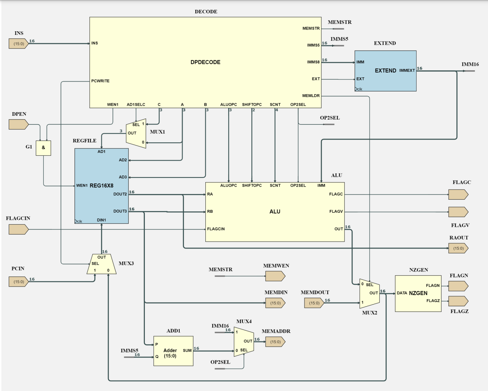
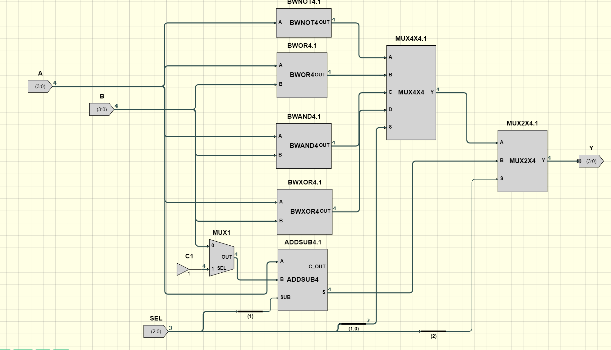
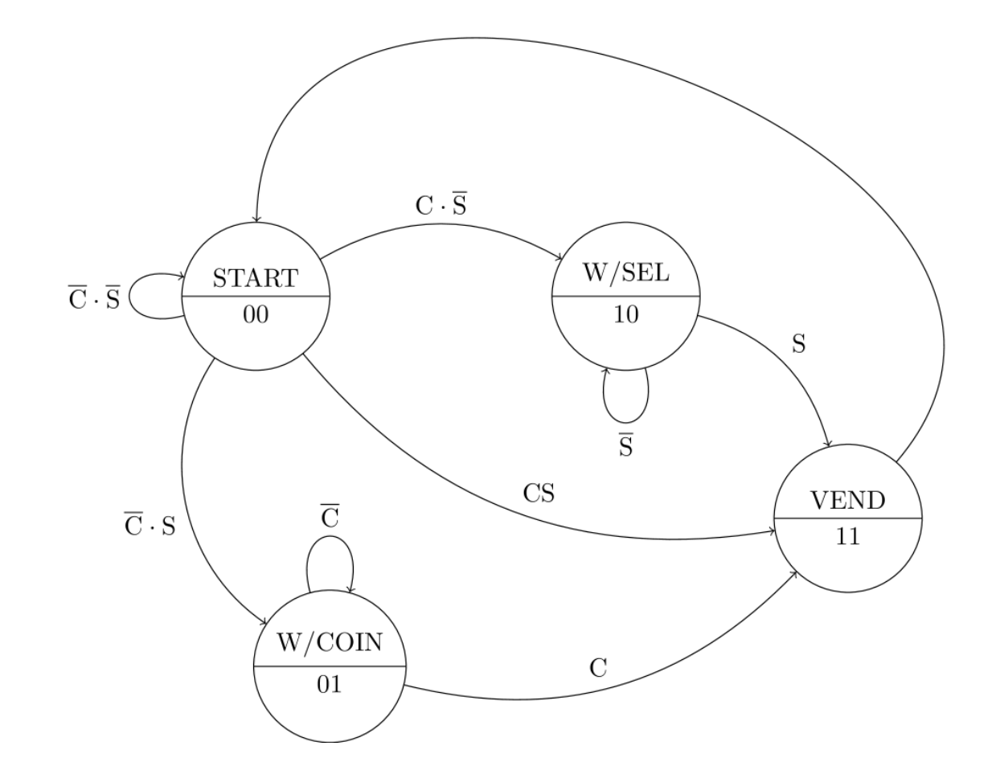
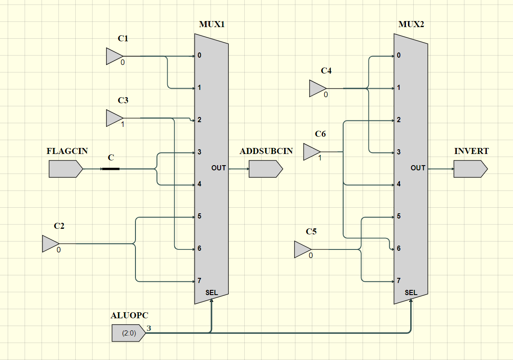
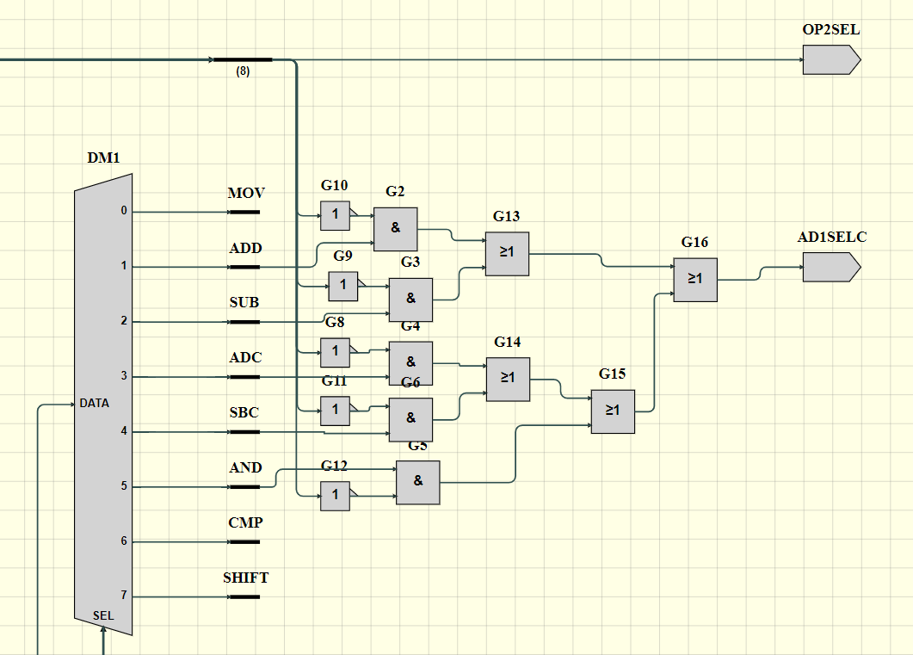
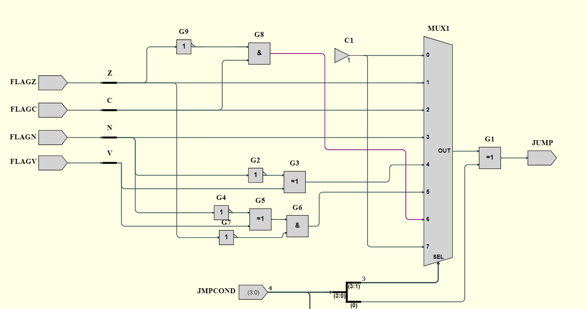
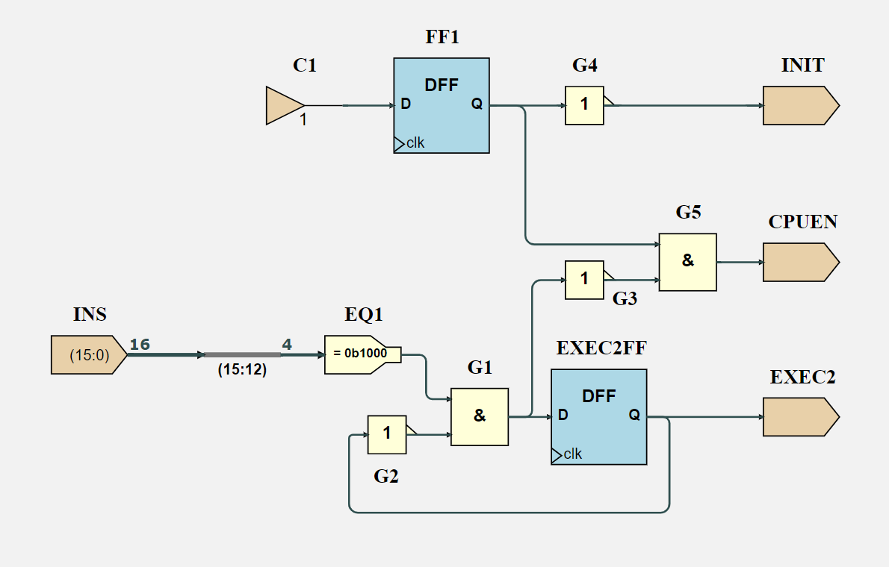

<div align="center">

# 16-bit CPU — From Logic Gates to a Pipelined Processor

**Building the EEP1, a 16-bit RISC-style CPU, from scratch in the Issie digital-logic simulator. It starts with a half adder and ends with a pipelined processor that handles interrupts and runs assembly programs I wrote for it.**




<sub><i>The EEP1 datapath: decoder, 8×16-bit register file, ALU, immediate extender and flag generation.</i></sub>

</div>

---

## Overview

This project covers my work on a 16-bit CPU for the *Digital Electronics and Computer Architecture* (DECA) labs at Imperial College London, December 2022 to March 2023. It builds bottom-up: each stage uses the blocks from the stage before, and I tested every block before moving to the next one.

| | |
|---|---|
| **Word size** | 16-bit data, 16-bit instructions |
| **Registers** | 8 general-purpose (`R0`–`R7`), plus the `N Z C V` status flags |
| **Memory** | Separate instruction ROM (`CODEMEM`, 64K × 16-bit) and data RAM (`DATAMEM`) |
| **ISA** | ALU, shift, load/store and conditional-jump instructions, with an `EXT` prefix for 16-bit immediates |
| **Extras** | 2-stage pipeline, memory-mapped I/O, hardware interrupts (`IRQ0`/`IRQ1`) |
| **Verification** | Waveforms compared cycle by cycle against a reference model (`eep1model`) |

> **About authorship:** EEP1 was designed by the course team, who provided the ISA, a reference model and partly finished Issie sheets. My work was building the foundation circuits, designing the missing decode and control logic, fixing faulty blocks, writing and optimising assembly programs, and analysing the pipeline and interrupt behaviour. Each step is written up in the logbooks below.

---

## Milestones (in order)

### 1. Digital arithmetic and a 4-bit ALU
I built a **half adder**, then a **full adder**, then a **4-bit ripple-carry adder**. I added a controllable inverter so the adder could also **subtract** using two's complement (`A − B = A + ¬B + 1`). One `SUB` signal both inverts `B` and supplies the carry-in.

That adder/subtractor became the core of an **8-operation ALU** with a 3-bit opcode. The top opcode bit chooses between bitwise and arithmetic results, and the lower two bits pick the exact operation.

| `S2 S1 S0` | Operation | `S2 S1 S0` | Operation |
|:--:|---|:--:|---|
| `000` | NOT A | `100` | A + B |
| `001` | A OR B | `101` | A + 1 |
| `010` | A AND B | `110` | A − B |
| `011` | A XOR B | `111` | A − 1 |

<p align="center"></p>

### 2. Sequential circuits, memory and state machines
- **Registers and counters** built from D flip-flops: a 4-bit counter, a counter with synchronous load, and a **self-reloading countdown timer** that uses a reduction-NOR to detect zero.
- **ROM-driven message writer:** a counter I designed steps through the ROM addresses, including a custom bitwise comparator that makes it count over `0 ≤ n < D`.
- **Vending-machine FSM:** I drew the state diagram, derived the transition logic from Karnaugh maps, and implemented it in Issie as separate next-state (`NXT`) and output (`OUT`) blocks around a state register.

<p align="center"></p>

### 3. EEP1 datapath: instruction decode and ALU control
I wrote truth tables from the instruction encoding and turned them into combinational logic in the datapath's decode blocks:

- **`DPDECODE`:** generates `Op2Sel`, which picks a register or an 8-bit immediate as the second operand, and `AD1SelC`, which picks the destination register (`Ra` or `Rc`). It also drives `WEN1` for register write-back.
- **`ALUDECODE`:** sets the adder's carry-in and invert inputs and the carry-flag write-enable for `MOV / ADD / SUB / ADC / SBC / AND / CMP`.
- **Bug fixes:** I found that the given `WEN1` logic wrongly wrote results back on `CMP`, and that the bitwise `AND` path was missing its immediate-operand case. I also connected the shift unit's barrel-shifter enables (`Shiftₙ.EN = SCNT(i)`) so `LSL / LSR / ASR / XSR` worked.

| `ALUDECODE` truth table → logic | `DPDECODE` operand/destination select |
|:--:|:--:|
|  |  |

I checked every change by running the course's [test programs](example_programs/course-tests/) (`lab1testmovadd`, `lab1testarith`, `lab1testandcmp`, `lab1testshift`) on my design and on the reference model, working out the expected register values by hand, and confirming that the waveforms matched cycle by cycle.

### 4. Control path: jumps and conditional branching
I wrote the next-PC selection logic (`PC+1`, `PC+offset` or `RA` for subroutine return) and built the **branch-condition** logic from the status flags:

| Condition | Logic | Used by |
|---|---|---|
| Signed ≥ | `¬N ⊕ V` | `JGE` / `JLT` |
| Signed > | `(¬N ⊕ V) · ¬Z` | `JGT` / `JLE` |
| Unsigned > | `C · ¬Z` | `JHI` / `JLS` |

I checked the design against Issie's **algebraic truth tables**.

<p align="center"></p>

### 5. Assembly programming: shift-and-add multiplication
EEP1 has no multiply instruction, so I translated a shift-and-add multiply algorithm into EEP1 assembly by hand and ran it on the CPU. The source files are in [`example_programs/`](example_programs/).

<details open>
<summary><b>16-bit multiply (optimised)</b>: 12 × 5 = 60 · <a href="example_programs/multiply_16bit_optimised.asm"><code>multiply_16bit_optimised.asm</code></a></summary>

```asm
// --- setup -------------------------------------------------------------------
        MOV     R1, #12         // op1 = 12
        MOV     R2, #5          // op2 = 5
        MOV     R0, #0          // sum = 0
        MOV     R3, R2          // op2_shifted = op2

// --- while (op1 != 0) --------------------------------------------------------
// loop:
        CMP     R1, #0          // op1 == 0 ?
        JEQ     #8              //   yes -> exit loop
        LSR     R1, R1, #1      // op1 >>= 1, low bit goes to carry
        JCC     #2              // bit was 0 -> skip the add
        ADD     R0, R0, R3      //   sum += op2_shifted
        LSL     R3, R3, #1      // op2_shifted <<= 1
        CMP     R1, #0          // op1 == 0 ?
        JNE     #-7             //   no -> back to loop
```
**Optimisation:** my [first version](example_programs/multiply_16bit.asm) shifted `op1` into a temporary register to test whether it was odd, then shifted `op1` again. This version shifts `op1` once and branches on the **carry flag** from that shift. It is two instructions shorter and frees a register.
</details>

<details>
<summary><b>32-bit product</b>: 2583 × 4381 = 11,316,123 (<code>0x00ACAB9B</code>) · <a href="example_programs/multiply_32bit.asm"><code>multiply_32bit.asm</code></a></summary>

```asm
// --- setup -------------------------------------------------------------------
        EXT     0x0A            // upper 8 bits for the next immediate
        MOV     R1, #0x17       // op1 = 0x0A17 = 2583
        EXT     0x11
        MOV     R2, #0x1D       // op2 = 0x111D = 4381
        MOV     R5, #0          // sum (low)          = 0
        MOV     R6, #0          // sum (high)         = 0
        MOV     R3, R2          // op2_shifted (low)  = op2
        MOV     R4, #0          // op2_shifted (high) = 0

// --- while (op1 != 0) --------------------------------------------------------
// loop:
        CMP     R1, #0          // op1 == 0 ?
        JEQ     #9              //   yes -> exit (idles on final JMP)
        MOV     R0, R1          // R0 = op1
        LSR     R0, R0, #1      // shift low bit of op1 into carry
        JCC     #3              // bit was 0 -> skip the add
        ADD     R5, R5, R3      //   sum.low  += op2_shifted.low
        ADC     R6, R6, R4      //   sum.high += op2_shifted.high + carry
        ADD     R3, R3, R3      // op2_shifted.low  <<= 1
        ADC     R4, R4, R4      // op2_shifted.high <<= 1, with carry in
        LSR     R1, R1, #1      // op1 >>= 1
        JMP     #-10            // back to loop
```
EEP1 has no extended *left* shift, so I built one with an `ADD` / `ADC` pair (doubling a value shifts it left by one). `EXT` supplies the upper 8 bits of each 16-bit constant. The simulation finished with `R6:R5 = 0x00AC:0xAB9B`, which is correct.
</details>

### 6. Pipelining and interrupts
- **2-stage pipeline (EEP1P):** I examined how the control path feeds `PCNEXT` straight to the instruction-memory address, skipping the PC register, so the next instruction is fetched while the current one executes. I also drew state diagrams for the pipeline controller, which uses one flip-flop for the first cycle after reset (`INIT`) and another for the extra execute cycle that loads need (`EXEC2`, `INS[15:12] = 1000`).
- **Interrupts:** I compared polling with interrupt-driven I/O. I traced how the interrupt hardware saves the program counter in a shadow `PCX` register, jumps to the interrupt service routine (ISR), and returns with `RETINT`. I then confirmed from the waveforms that the base program's PC, flags and registers come back unchanged, including with two interrupt sources (`IRQ0` and `IRQ1`).

<p align="center"></p>

---

## Engineering practices
The hardware is the subject, but the way I worked on it is the same way I work on software:

- **Modular, hierarchical design:** small blocks (full adder → `addsub4` → ALU) are reused as black boxes. When the ROM project would not simulate, I traced it to missing sub-sheet dependencies and fixed it by bringing in the whole dependency tree.
- **Testing against a reference:** every block was checked against a reference model, hand-worked expected values, or automatically generated truth tables before being built on.
- **Specification first:** I wrote truth tables and state diagrams from the specification before building any circuit.
- **Debugging by reasoning:** unexpected results, such as a register reading `-1` where I expected `255`, or an `ADC` result that was one higher than predicted, were traced to their causes (8-bit sign extension, and a carry left over from the previous instruction) instead of being worked around.
- **Keeping a record:** a dated logbook records decisions, mistakes and corrections as the work went on.

---

## Repository contents

The work is documented in seven lab logbooks, in the order they were built:

| # | Logbook | Topics |
|:-:|---|---|
| 1 | [Digital Arithmetic](01_Digital_Arithmetic.pdf) | Half/full adders, ripple-carry adder, two's-complement subtraction, 4-bit ALU |
| 2 | [Sequential Circuits](02_Sequential_Circuits.pdf) | D flip-flop registers, counters, synchronous load, auto-reset countdown timer |
| 3 | [Memory](03_Memory.pdf) | ROM initialisation, hierarchical design, ROM-driven message writer |
| 4 | [State Machines](04_State_Machines.pdf) | State diagrams, Karnaugh maps, vending-machine FSM |
| 5 | [Datapath & ALU](05_Datapath_and_ALU.pdf) | EEP1 machine code, `DPDECODE` / `ALUDECODE` logic, AND/CMP fixes, barrel shifter |
| 6 | [Control Path & Jumps](06_Control_Path_and_Jumps.pdf) | Next-PC logic, branch conditions, 16- and 32-bit multiply in assembly |
| 7 | [Pipelining & Interrupts](07_Pipelining_and_Interrupts.pdf) | EEP1P pipeline control, memory-mapped I/O, interrupt service routines |

```
16-bit-cpu/
├── 01_Digital_Arithmetic.pdf
├── 02_Sequential_Circuits.pdf
├── 03_Memory.pdf
├── 04_State_Machines.pdf
├── 05_Datapath_and_ALU.pdf
├── 06_Control_Path_and_Jumps.pdf
├── 07_Pipelining_and_Interrupts.pdf
├── example_programs/     # EEP1 assembly programs (multiply routines)
│   ├── multiply_16bit.asm
│   ├── multiply_16bit_optimised.asm
│   ├── multiply_32bit.asm
│   └── course-tests/     # course-provided test programs (credited, not my work)
└── docs/images/          # schematics used in this README
```

---

## Tools
- **[Issie](https://github.com/tomcl/issie):** an open-source schematic editor and simulator for digital circuits, used for design, waveform simulation and truth-table generation.
- **EEP1 assembler:** turns EEP1 assembly into machine code (`.ram`) that is loaded into the instruction ROM.

## Acknowledgements
The EEP1 architecture, reference model and lab materials are by the Imperial College London DECA teaching team (Ed Stott and Tom Clarke). The circuits, analysis and programs in the logbooks are my own work.

---

<div align="center">
<sub>Built by <a href="https://github.com/AtlasICL">Atlas Acarsoy</a> · 2022–2023</sub>
</div>
